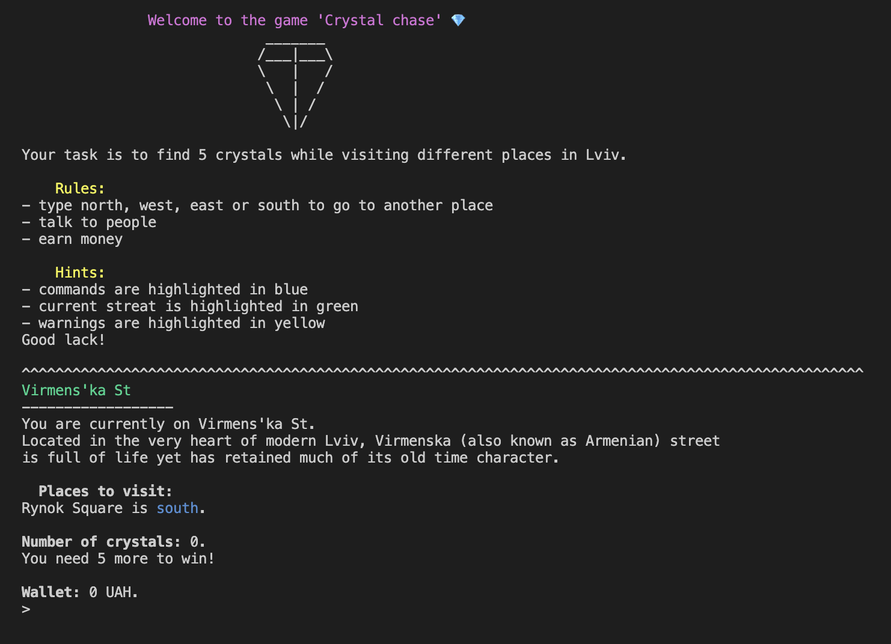
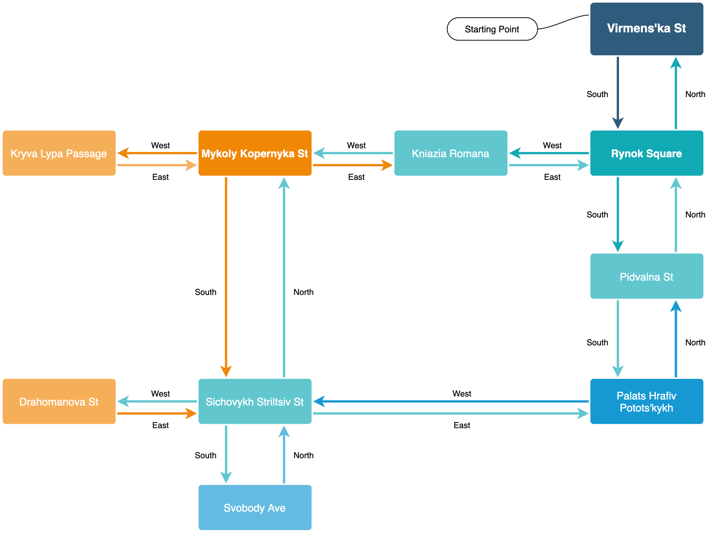

# Crystal Chase

<h1 align="center">
  <br>
  
  <br>
  Crystal Chase
  <br>
</h1>

<p align="center" style='margin-left: 10px;margin-right: 10px;'>Welcome to the exciting world of <span style='font-weight: 700'>Crystal Chase</span>! This is a command line game where you need to find 5 crystals while exploring different locations in Lviv. It's an adventure game where to can talk to people, put some items on the way in your backpack, earn money and so on.<br><br></p>

<p align="center" style='margin-left: 10px;margin-right: 10px;'>Moreover, the text is <span style='font-weight: 700'>highlighted</span> in your terminal to distinguish commands, warning and streats.</p>


<p align="center">
  <a href="#description">Description</a> •
  <a href="#how-to-use">How To Use</a> •
  <a href="#example-of-usage">Example of usage</a> •
  <a href="#emailware">Emailware</a>
</p>


## Description

In this adventure game, you will embark on a thrilling journey through **Lviv** full of puzzles and anvetures.

Your mission is to collect 5 crystals scattered throughout the land. To win the game, you must return them to the central temple before time runs out (time limit is 10 minutes).

As you journey through the land, you will encounter various challenges. You will need to solve puzzles and think logically. You'll also have the chance to earn money to complete different tasks.

So, are you ready to embark on an epic adventure and collect the crystals to win? The fate of the land is in your hands - let the **Crystal Chase** begin!


## How To Use

Clone and run this application from your command line:

```bash
# Clone this repository
$ git clone https://github.com/kretsulaksusha/Crystal_chase

# Go into the repository
$ cd Crystal_chase

# Run the game
$ python3 crystal_game/main.py
```


## Example of usage

Type in the following line in your Terminal:
```
$ python3 crystal_game/main.py
```
Expected output
```
        Welcome to the game 'Crystal chase' 💎
                       _______
                      /___|___\
                      \   |   /
                       \  |  / 
                        \ | /  
                         \|/

Your task is to find 5 crystals while visiting different places in Lviv.

    Rules:
- type north, west, east or south to go to another place
- talk to people
- earn money

    Hints:
- commands are highlighted in blue
- current streat is highlighted in green
- warnings are highlighted in yellow
Good lack!

^^^^^^^^^^^^^^^^^^^^^^^^^^^^^^^^^^^^^^^^^^^^^^^^^^^^^^^^^^^^^^^^^^^^^^^^^^^^^^^^^^^^^^^^^^^^^^^^^^^^
Virmens'ka St
------------------
You are currently on Virmens'ka St.
Located in the very heart of modern Lviv, Virmenska (also known as Armenian) street
is full of life yet has retained much of its old time character.

  Places to visit:
Rynok Square is south.

Number of crystals: 0.
You need 5 more to win!

Wallet: 0 UAH.
> 
```
Then you type in a different commands and complete tasks to win in this game.<br><br>

<h2 align="center">Colored text in terminal</h2>


<h2 align="center">Connection between streats</h2>


## Emailware

Crystal Chase is an [emailware](https://en.wiktionary.org/wiki/emailware). Meaning, if you liked using this app or it has helped you in any way, I'd like you send me an email at <kretsula.k@gmail.com> about anything you'd want to say about this game. I'd really appreciate it!
